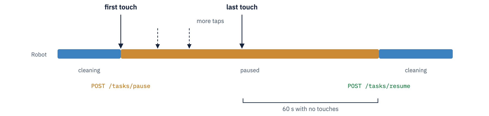
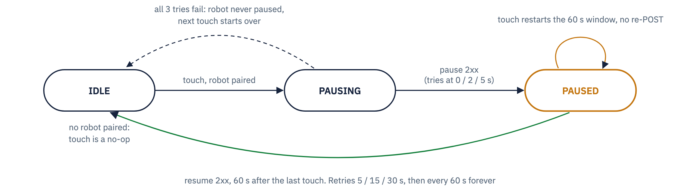

# Robot API Test

[PDF version of this document](docs/RobotApiTest.pdf)

Harness around `RobotPauseController.kt`, copied out of our app unchanged (only edit:
Timber became the on-screen log). Whatever gets fixed here, I'll port back.
Logic is in `RobotPauseController.kt`; UI and transport in `MainActivity.kt`.

## What I tried to build

- First touch sends pause, once per engagement, attempts at 0 / 2 / 5 s. The button
  becomes a 60 s countdown.
- Further taps restart the countdown without re-sending pause.
- 60 s with no taps sends resume, retrying at 5 / 15 / 30 s, then every 60 s until 2xx.
  Intent: the robot can never be left stranded in pause.
- If the app dies while the robot is paused, a persisted flag makes the next launch
  send resume immediately.

Every request, result, and retry shows in the on-screen log with timestamps.

## Robot API

| | |
|---|---|
| Endpoint | `http://<robot-ip>:7242` (plain HTTP, no auth) |
| Pause | `POST /api/v1/tasks/pause` |
| Resume | `POST /api/v1/tasks/resume` |
| Request | empty body, 3 s timeout, any 2xx = success |
| Network | the robot's own hotspot (its GSM router creates the LAN); pause/resume never rides GSM |

## Running it

Android Studio, on a device joined to the robot's hotspot. The URL field defaults to
port 7242, plain http (manifest allows cleartext for this). `pauseWindowMs`, where the
controller is constructed in `MainActivity.kt`, shortens the 60 s wait for testing.

## If it misbehaves, my first guesses

| Symptom | Where I'd suspect the cause sits |
|---|---|
| No countdown, log says `pause failed` | Robot unreachable: wrong IP/port, tablet dropped off the robot's hotspot, or API down. A direct `curl -X POST http://<ip>:7242/api/v1/tasks/pause` separates my code from the network |
| Log says `touch ignored, no robot configured` | My guard for a URL field not starting with `http`; the controller never ran |
| Countdown hits 0, robot stays stopped | The log should show resume retrying; my code is sending, the robot is rejecting or not receiving `/tasks/resume` |
| Countdown and the log's resume time disagree | A timing bug in my controller. The countdown is a deliberately independent UI clock, so divergence means the controller's own timer is off |
| Robot moves while someone is tapping | The race I'm most worried about: a tap cancelled an in-flight resume the robot already acted on, and my pause-once rule means pause is never re-sent |
| Robot stuck paused after a crash | My boot recovery should post resume on the next launch, targeting the currently paired address |

## The controller's state machine

Pause is sent once per engagement: only the IDLE-to-PAUSING edge posts pause. While
PAUSED, every touch just cancels and restarts the resume timer.

## Where I'd value scrutiny

These are the parts I'm least confident about; a second pair of eyes here helps me most.

- **Resume-cancellation race** (`restartResumeWindow()` + `resumeUntilSuccess()`): a touch
  can cancel an in-flight resume after the robot already acted on it, leaving the robot
  moving while the app thinks PAUSED. Open question: should the PAUSED touch path
  re-verify robot state?
- **Single-thread assumption**: `state` / `pausedTarget` / `resumeJob` have no
  synchronization; safe only because the injected scope is main-dispatcher. Undocumented
  in the class.
- **PAUSING taps**: taps during the up-to-7 s pause-retry sequence collapse into the
  1-slot `SharedFlow` buffer; the one queued emission is what extends the window afterwards.
