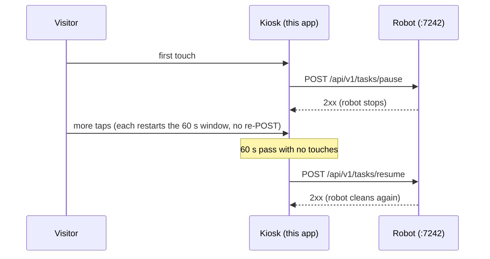
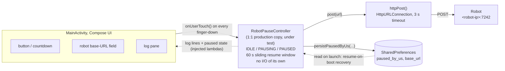
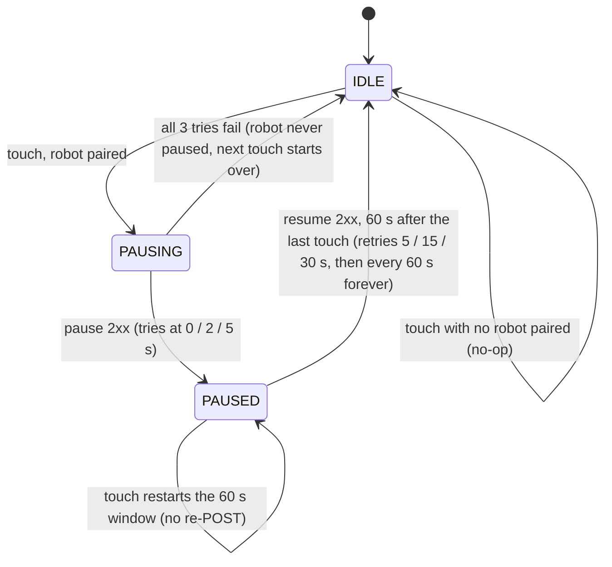

# RobotApiTest Architecture

A one-screen Android app whose only job is to exercise the production `RobotPauseController`
against a real robot. The controller is a verbatim copy of the class our kiosk ships;
everything around it is a thin, replaceable shell.

## The job, end to end

Our kiosk shares the venue floor with a Saha Robotik cleaning robot. The moment a visitor
touches the kiosk screen, the robot must stop moving. While the visitor keeps tapping, it must
stay stopped. Sixty seconds after the last touch, it must always return to cleaning, even if
the network flakes or the app crashes in between. This app lets anyone verify that contract
with one button.

Pause is posted once, at the first touch of an engagement. Every further tap restarts the
60-second quiet window without re-posting. Resume fires when the window finally runs out,
and retries until the robot confirms it.

## Robot connection

These values come from the production pairing module (`RobotModule.kt`) and are what both
the kiosk and this test app use.

| | |
|---|---|
| Endpoint | `http://<robot-ip>:7242` |
| Transport | plain HTTP, no auth, LAN |
| Pause | `POST /api/v1/tasks/pause` |
| Resume | `POST /api/v1/tasks/resume` |
| Request | empty body, 3 s timeout |
| Success | any 2xx status |

## How the pieces talk

The controller is the production class, copied verbatim. It owns all pause and resume policy
but does no I/O. Touches come in through `onUserTouch()`, and its injected lambdas are its
only reach into the outside world: `target()` reads the URL field, `post()` sends the request,
`persistPausedByUs()` stores the crash-recovery flag, `log()` feeds the screen.

## The controller's state machine

Pause is sent once per engagement: only the IDLE-to-PAUSING edge posts pause. While PAUSED,
every touch just cancels and restarts the resume timer. Resume retries forever, and the
persisted `paused_by_us` flag replays the resume on next app launch if the process dies
mid-pause.

## Why it's shaped this way

- **Dependency inversion at the seam.** The controller takes its robot address, transport,
  persistence, and logging as constructor lambdas. Production plugs in its own implementations;
  this harness plugs in a text field, a bare `HttpURLConnection`, `SharedPreferences`, and an
  on-screen log. The class under test can't tell the difference.
- **Two clocks, on purpose.** The button's countdown is UI-side; the controller runs its own
  timer. If the log's resume moment disagrees with the countdown, that divergence is the bug
  this app exists to make visible.
- **Serialized state.** Touches funnel through a 1-slot `SharedFlow` (drop-oldest), so a touch
  storm collapses to one "touched again" signal and all state changes happen on a single
  collector. No locks.
- **Nothing proprietary.** The shell is generic Android; the only shared piece is the pause
  controller itself, copied with one documented change (Timber replaced by an injected `log`
  lambda).

## Critical code paths

The parts of the controller where the behavior is least obvious and a bug would matter most:

- **The resume-cancellation window** in `restartResumeWindow()` + `resumeUntilSuccess()`.
  A touch can cancel a resume whose POST is already in flight: the robot may resume while the
  app still believes it is PAUSED. The robot could then be *moving during an engagement*, and
  pause is never re-sent (pause-once rule). An open question is whether the PAUSED-state touch
  path should re-verify the robot's actual state.
- **The single-dispatcher assumption.** `state`, `pausedTarget` and `resumeJob` are mutated
  from both the touch collector and the resume job with no synchronization. That is safe only
  while the injected scope is single-threaded, and the constraint is currently undocumented in
  the class itself.
- **The PAUSING no-op branch.** Touches during the up-to-7 s pause-retry sequence rely on the
  1-slot buffer to extend the window afterwards. This is the subtlest interaction in the class,
  and the reason the touch flow uses drop-oldest buffering.
- **Boot recovery vs. re-pair.** In-process resume targets the address captured at pause time;
  after a crash, recovery resumes whatever robot is *currently* paired. If a re-pair happens
  between crash and relaunch, the previous robot stays paused.
