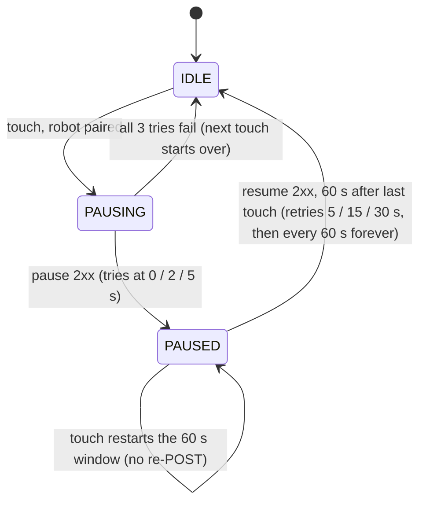

# RobotApiTest — Debug Reference

One button driving `RobotPauseController` — a verbatim copy of the class under test
(only change: Timber replaced by the on-screen log). Every tap = one touch event.
The two files that matter:

| File | What's in it |
|---|---|
| `RobotPauseController.kt` | All pause/resume logic. If behavior is wrong, the bug is here. |
| `MainActivity.kt` | UI, `httpPost()` transport, wiring. The countdown is UI-side only. |

## Expected behavior

1. First tap → `POST /tasks/pause` (retries at 0 / 2 / 5 s) → button becomes a 60 s countdown.
2. Taps while paused → countdown restarts. No re-POST of pause.
3. 60 s with no taps → `POST /tasks/resume` (retries 5 / 15 / 30 s, then every 60 s forever until 2xx).
4. App killed while robot paused → next launch resumes the robot immediately (`paused_by_us` flag).

## Robot API

| | |
|---|---|
| Endpoint | `http://<robot-ip>:7242` (plain HTTP, no auth, same LAN) |
| Pause | `POST /api/v1/tasks/pause` |
| Resume | `POST /api/v1/tasks/resume` |
| Request | empty body, 3 s timeout, any 2xx = success |

## If it's not working

Everything the controller does is in the on-screen log with timestamps. Match your symptom:

| Symptom | Where to look |
|---|---|
| Button never turns into a countdown, log shows `pause failed` | Robot unreachable: wrong IP/port, different network, or robot API down. Curl it: `curl -X POST http://<ip>:7242/api/v1/tasks/pause` |
| Log shows `touch ignored — no paired robot` | The URL field doesn't start with `http` |
| Countdown reaches 0 but robot stays stopped | Watch the log: resume is retrying. Robot is rejecting or not receiving `/tasks/resume` |
| Countdown and the log's `resumed` line disagree in time | Controller timing bug. The countdown is an independent UI clock; divergence means the controller's own timer is off |
| Robot starts moving while someone is still tapping | The resume-cancellation race: a tap cancelled a resume whose POST was already in flight (`restartResumeWindow()` / `resumeUntilSuccess()`). Pause is never re-sent once PAUSED |
| Robot stuck paused after the app crashed | Relaunch the app: boot recovery posts resume. Note it targets the *currently* paired address, not the one captured at pause time |

## State machine

## Known sharp edges

- **Resume-cancellation race**: a touch can cancel an in-flight resume after the robot already
  acted on it → robot moving while the app thinks PAUSED. Open question: should the PAUSED touch
  path re-verify robot state?
- **Single-thread assumption**: `state` / `pausedTarget` / `resumeJob` have no synchronization;
  safe only because the injected scope is main-dispatcher. Undocumented in the class.
- **PAUSING taps**: taps during the up-to-7 s pause-retry sequence collapse into the 1-slot
  `SharedFlow` buffer; the one queued emission is what extends the window afterwards.
- **Faster testing**: pass a smaller `pauseWindowMs` where the controller is constructed in
  `MainActivity.kt` to avoid waiting 60 s per cycle.
